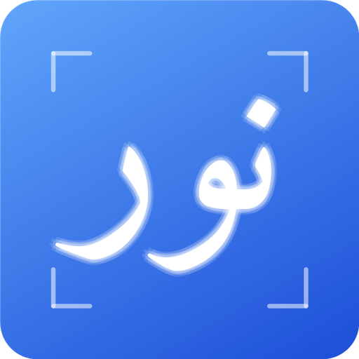
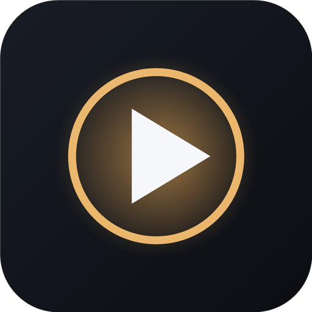

# Featured Projects — Jumanazar Said Ruzim

Selected shipped work: desktop and mobile products, plus the web platform and
services behind them. Most source repos are private — links point to the live
product, a release build, or a demo.

**Contact** — [GitHub @jsr1611](https://github.com/jsr1611) ·
[Telegram @jsr1611](https://t.me/jsr1611)

| Project | Type | Built | Stack | Get it |
|---|---|---|---|---|
| [NurPhoto](#nurphoto) | Desktop app | 2026-07 | Tauri v2, Rust | [Download](../../releases/tag/nurphoto-v0.1.0) |
| [NurMail](#nurmail) | Android app | 2026-07 | Kotlin, Compose | _TBD_ |
| [NurMedia](#nurmedia) | Desktop app | 2026-07 | Tauri v2, Rust, ffmpeg | [Download](../../releases/tag/nurmedia-v0.1.0) |
| [HTTP Client](#http-client) | Desktop app | 2026-07 | Tauri v2, Rust | [Download](../../releases/tag/http-client-v0.1.0) |
| [Arabic Learning Platform](#arabic-learning-platform) | Web platform | 2023-12 → present | Angular, Node.js, MongoDB | [jumanazar.uz](https://jumanazar.uz) |

All installers are published on the [Releases](../../releases) page. They are
not code-signed yet, so Windows SmartScreen may warn on first run — choose
**More info → Run anyway**.

---

## NurPhoto — desktop photo workbench

Everyday photo editing plus compliant **ID, passport and visa photos**. Open,
straighten, rotate, flip, crop with aspect presets, adjust tone, sharpen, and
export with real control over pixel size, DPI and file size.

Document presets lock the frame, configure the whole export (pixels, DPI, byte
ceiling, background), position the face automatically against the spec's
guides, and report compliance afterwards. Print sheets tile the photo at exact
physical size. Everything runs locally — identity documents never leave the
machine: no upload, no account, no server.

- **Built** — 2026-07
- **Platforms** — Windows, Linux, macOS
- **Stack** — Tauri v2, Rust, HTML/JS in the system WebView
- **Download** — [Windows installer (.exe)](../../releases/download/nurphoto-v0.1.0/NurPhoto_0.1.0_x64-setup.exe) ·
  [MSI](../../releases/download/nurphoto-v0.1.0/NurPhoto_0.1.0_x64_en-US.msi) — v0.1.0, ~6 MB
- **Source** — private

<!-- screenshots: drop files in screenshots/nurphoto/ and uncomment

  
  

-->

---

## NurMail — local-first Android email client

Minimalist mail without the bloat. IMAP/POP3 receiving and optional SMTP
sending, with server settings auto-detected from the email domain.

The on-device database is the source of truth — the server mailbox is never
modified unless you opt in. A trainable naive-Bayes spam filter learns from
*Mark as spam* / *Not spam*; full-text search covers subject, sender, body and
attachment names; HTML mail renders in a WebView with remote images blocked by
default (no tracking pixels). A configurable 14-day retention window keeps the
phone from filling up, while messages moved into a folder are kept forever.
Five languages: Uzbek (default), English, Russian, Arabic (RTL), Korean.
Credentials live in `EncryptedSharedPreferences` behind the Android Keystore.

- **Built** — 2026-07
- **Platforms** — Android
- **Stack** — Kotlin, Jetpack Compose
- **Download** — signed APK: _TBD_ (build it and I'll attach it to a release)
- **Source** — private

<!-- screenshots: screenshots/nurmail/ -->

---

## NurMedia — cross-platform video trimmer

Open a 40–60 minute video and cut it into short clips with a real editor
timeline. Built on a modular shell with a shared job runner that drives
`ffmpeg`/`ffprobe` natively, so long exports stay responsive and cancellable.

- **Built** — 2026-07
- **Platforms** — Windows, Linux, macOS (Apple Silicon)
- **Stack** — Tauri v2, Rust, ffmpeg/ffprobe
- **Download** — [Windows installer (.exe)](../../releases/download/nurmedia-v0.1.0/NurMedia_0.1.0_x64-setup.exe) ·
  [MSI](../../releases/download/nurmedia-v0.1.0/NurMedia_0.1.0_x64_en-US.msi) — v0.1.0, ~2 MB
  (requires `ffmpeg` and `ffprobe` on PATH)
- **Source** — private

<!-- screenshots: screenshots/nurmedia/ -->

---

## HTTP Client — native Windows request client

A Postman-lite desktop client. A Rust backend makes the real HTTP calls via
`reqwest` while a static frontend renders in the system WebView2 — no CORS, no
bundled browser, near-instant startup. Method, URL, editable header rows and
JSON body; responses show color-coded status, timing, size, collapsible headers
and pretty-printed JSON.

- **Built** — 2026-07
- **Platforms** — Windows
- **Stack** — Tauri v2, Rust (`reqwest`), WebView2
- **Download** — [Windows installer (.exe)](../../releases/download/http-client-v0.1.0/HTTP-Client_0.1.0_x64-setup.exe) — v0.1.0, ~2 MB
- **Source** — private

<!-- screenshots: screenshots/http-client/ -->

---

## Arabic Learning Platform — [jumanazar.uz](https://jumanazar.uz)

A web platform for learning Arabic: dictionary, lessons and learner tooling,
fully localized in Uzbek and Arabic. The Angular frontend is deployed on
Vercel; the REST backend — Arabic dictionary data, JWT authentication, MongoDB
persistence and supporting integrations — runs on Render.

- **Built** — 2023-12 → present (actively maintained)
- **Stack** — Angular (TypeScript) · Node.js, MongoDB, JWT
- **Links** — live: [jumanazar.uz](https://jumanazar.uz)

<!-- screenshots: screenshots/jumanazar/ -->

---

## Tech I work with

**Desktop** Tauri v2, Rust · **Mobile** Kotlin, Jetpack Compose ·
**Web** Angular, React, TypeScript · **Backend** Node.js, Spring Boot, Java,
Python · **Data** MongoDB, PostgreSQL · **Media** ffmpeg, Media3
